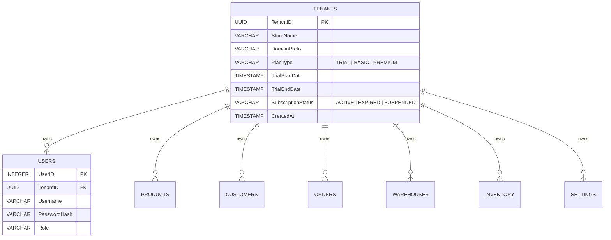

# SaaS Multi-Tenancy Database Design & Security Specification

This document details the database schema and query scoping mechanisms proposed for upgrading Ceramic ERP into a secure, isolated multi-tenant platform.

---

## 1. Schema Modifications

We will add a new `Tenants` table to manage store metadata, trial periods, and subscription states. We will also add a `TenantID` column to all business-related tables.



### New Table: `Tenants`
```sql
CREATE TABLE IF NOT EXISTS Tenants (
    TenantID UUID PRIMARY KEY DEFAULT gen_random_uuid(),
    StoreName TEXT NOT NULL,
    DomainPrefix TEXT UNIQUE NOT NULL, -- e.g., 'allaoua-ceram' (for subdomain or tenant identification)
    PlanType TEXT NOT NULL DEFAULT 'TRIAL' CHECK (PlanType IN ('TRIAL', 'BASIC', 'PREMIUM')),
    TrialStartDate TIMESTAMPTZ DEFAULT CURRENT_TIMESTAMP,
    TrialEndDate TIMESTAMPTZ NOT NULL, -- Calculated as TrialStartDate + 20 days
    SubscriptionStatus TEXT NOT NULL DEFAULT 'ACTIVE' CHECK (SubscriptionStatus IN ('ACTIVE', 'EXPIRED', 'SUSPENDED')),
    CreatedAt TIMESTAMPTZ DEFAULT CURRENT_TIMESTAMP,
    UpdatedAt TIMESTAMPTZ DEFAULT CURRENT_TIMESTAMP
);
```

### Table Scoping Updates
Add `TenantID UUID REFERENCES Tenants(TenantID) ON DELETE CASCADE` and indexes to the following tables:
- `Categories` (allows tenant-defined catalog categories)
- `Brands`
- `Units`
- `Products`
- `ProductUnits`
- `Warehouses`
- `Factories`
- `Inventory`
- `InventoryTransactions`
- `PriceLists`
- `PriceListItems`
- `BuyingPrices`
- `Customers`
- `CustomerProductPrices`
- `Orders`
- `OrderItems`
- `Invoices`
- `PurchaseOrders`
- `PurchaseOrderItems`
- `GoodsReceipts`
- `GoodsReceiptItems`
- `FactorySettlements`
- `SettlementItems`
- `CustomerContacts`
- `CustomerInteractions`
- `Payments`
- `PaymentAllocations`
- `AccountingEntries`
- `Employees`
- `Attendance`
- `PayrollPeriods`
- `Payroll`
- `Vehicles`
- `Drivers`
- `Deliveries`
- `VehicleMaintenances`
- `Users`
- `Permissions`
- `RolePermissions`
- `ActiveSessions`
- `Settings`

---

## 2. Row Level Security (RLS) Policy on Supabase
To ensure absolute data isolation and prevent SQL queries from accidentally exposing another tenant's data, we will enable PostgreSQL Row Level Security (RLS) on all scoped tables.

### Set Current Tenant Context
For every request, the application backend connection pool client sets a local session configuration variable:
```sql
SET LOCAL app.current_tenant_id = 'uuid-value-here';
```

### RLS Policies
We will apply policies of the following format to each tenant-scoped table:
```sql
-- Enable RLS
ALTER TABLE Products ENABLE ROW LEVEL SECURITY;

-- Create Scoping Policy
CREATE POLICY tenant_isolation_policy ON Products
    FOR ALL
    USING (TenantID = NULLIF(current_setting('app.current_tenant_id', true), '')::uuid);
```
With this setup, the database itself enforces the filter: any `SELECT`, `UPDATE`, or `DELETE` statement is restricted to the current tenant's ID context.

---

## 3. Query Scoping Strategy (Backend Pool Wrapper)
Rather than manually updating every raw SQL query in the backend controllers, we will wrap the database queries inside a helper that sets the session parameter.

In `backend/src/db/index.js`, we will wrap the `query` method to run inside a PostgreSQL transaction or local configuration block:

```javascript
// Scope wrapper example
async function tenantQuery(tenantId, sqlText, params) {
  const client = await pool.connect();
  try {
    await client.query(`SET LOCAL app.current_tenant_id = $1`, [tenantId]);
    const res = await client.query(sqlText, params);
    return res;
  } finally {
    client.release();
  }
}
```
This is robust, secure, and preserves 95% of our existing query structures without needing to append `AND tenant_id = $X` to every single query line in controllers.
